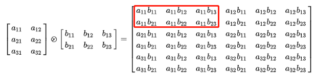

# kron

### 计算两个矩阵的 Kronecker 乘积
Kronecker 乘积是一个由第二个数组的块按第一个数组的比例缩放而成的复合数组。

## 参数

- `A`：矩阵密文，第一个输入元素， $ m\times n $维
- `B`：矩阵密文，第二个输入元素， $ p\times q $维
- `output_encrypt_type`：标量明文，可选 输出的数组密文的加密方式，默认返回的加密方式与输入数组的加密方式一致，若设定 $ output\_encrypt\_type=0 $，则返回的数组为行加密形式；若 $ output\_encrypt\_type=1 $，则返回的为列加密形式。

## 返回值

矩阵密文 `kron`：$ A $和$ B $的 Kronecker 乘积



## 示例
```python
import henumpy as hp
import crypto_toolkit as ct
import numpy as np

hp.initDict()
ct.initSK()

# 矩阵和矩阵
AA = np.array([[ 1.,  2.],[ 2., -3.]])
A = ct.encrypt(AA)
BB = np.array([[ 0.5,  4.],[ 4., 5.],])
B = ct.encrypt(BB)
res = hp.kron(A, B)
print(ct.decrypt(res))
# 输出 [[  0.5   4.    1.    8. ]
#       [  4.    5.    8.   10. ]
#       [  1.    8.   -1.5 -12. ]
#       [  8.   10.  -12.  -15. ]]
```
