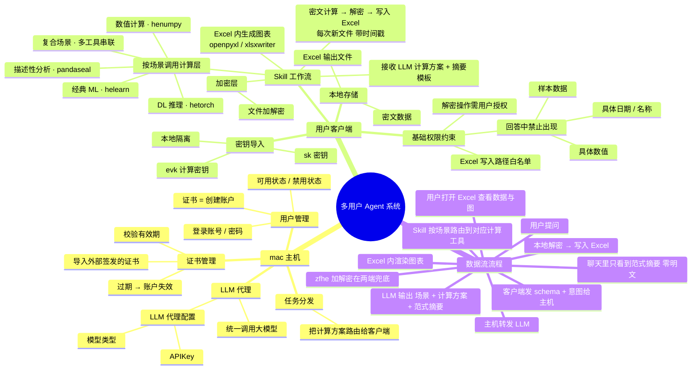

# 多用户 Agent 系统架构 · MVP

> 设计目标:多个用户通过本地 Agent 客户端使用大模型能力,数据全程加密、明文不出本机;
> mac 主机仅做认证、调度与 LLM 代理,不持有任何用户数据或密钥。

---

## 一、整体脑图



---

## 二、模块详解

每个模块按 **定位 / 职责 / 输入 / 输出 / 边界** 五段说明。
读完这一节,即使没看过设计讨论也能理解整套系统怎么运转。

### A · mac 主机

#### A1. 证书管理 — 账户准入闸门
- **定位:** 决定"哪个账户可用"的第一道门。

> **实现说明(v3):** 架构概念中的"证书"在实际实现里就是 HE 工具链的 **`user_authorization` 文件**。
> 真实的有效期 / 签名校验由 henumpy SDK 在 `hp.initDict(userFilePath=...)` 时完成;
> 主机只跟踪"每用户的授权文件 + 账户状态",客户端 init 失败会回报主机,主机据此 disable 账户。
> 每用户一份独立 `user_authorization`(per-user 模式)。代码中类名为 `AuthorizationManager`,
> `CertificateManager` 作为向后兼容别名保留。
- **职责:**
  - 导入由外部平台签发的证书(X.509 或类似格式)
  - 校验有效期、签名、吊销状态
  - **证书过期 / 吊销 → 对应账户立即失效**(标记为禁用,所有连接被拒绝,客户端的加密工具集自动停摆)
- **输入:** 外部平台导出的证书文件
- **输出:** 账户的可用 / 失效状态
- **边界(不做):** 不签发证书、不重新颁发、不修改证书内容 —— 这些都是外部平台的事

#### A2. 用户管理 — 账户与登录
- **定位:** 把"持证人"映射成"系统里的账户",并提供登录机制。
- **职责:**
  - **证书 = 创建账户**:一张有效证书对应一个账户(在证书导入时建账)
  - **账户状态:可用 / 禁用**(证书过期 → 自动转禁用;管理员也可手动禁用)
  - **登录认证:账号 + 密码**(在账户可用的前提下,用户用账号+密码登录获取会话)
- **输入:** 证书导入事件、登录请求
- **输出:** 账户列表与状态、登录后的会话 token
- **边界:** **不存对话历史、不存用户文件、不存任何业务数据**。账户本质上只是个"标签 + 状态灯 + 登录凭据"
- **认证模型:** 实质上是 **证书 + 账密** 双因子 —— 证书决定"账户存不存在 / 可不可用",账密决定"是不是本人来登录"

#### A3. LLM 代理 — 大模型统一出口
- **定位:** 集中管理大模型调用,所有客户端通过它访问 LLM。
- **职责:**
  - 转发请求到大模型 API
  - 注入系统 prompt
  - 限流与基础计费记账
- **配置项(admin 维护):**

  | 配置 | 说明 |
  |------|------|
  | 模型类型 | 选择对接的大模型(如 Claude / GPT / 其他),可切换 |
  | APIKey | 对应模型的 API 凭据,由 admin 在主机配置 |

- **输入:** 客户端发来的 schema + 用户意图(都是元数据,**绝无明文数据**)
- **输出:** LLM 的响应(`场景 + computation_plan + summary`)
- **边界:** 不缓存内容、不记录 prompt 主体(只记元数据如调用时间、token 数)、不接触密文、不接触密钥
- **价值:** 客户端不需要持有 API key、不需要关心模型切换 —— admin 在主机统一管。

#### A4. 任务分发 — 响应路由
- **定位:** 把 LLM 的响应送回发起请求的那个客户端。
- **职责:** 基于 session / 请求 ID 路由;失败重试
- **输入:** LLM 响应
- **输出:** 通过长连接推送给目标客户端
- **边界:** 不持久化任务内容,传完即弃

---

### B · 用户客户端

#### B1. 密钥导入 — HE 密钥的本地隔离仓
- **定位:** 同态加密密钥的本地存放点,**永不出本机**,且不同用户/不同进程之间严格隔离。
- **职责:** 导入并安全存储 `sk`(解密密钥)与 `evk`(计算密钥)
- **本地隔离的含义:**
  - 多用户共享同一台机器时,各自的密钥互不可见
  - 客户端进程之外的任何代码无法访问这些密钥
  - 不通过网络传输、不写入云同步目录
- **输入:** 外部平台导出的密钥文件
- **输出:** 仅供本机的加密层与计算层调用
- **边界:** 不生成密钥、不上传、不通过网络传输
- **推荐实现:** macOS 上用 Keychain / Secure Enclave 加固

#### B2. 本地存储 — 用户的私人数据仓库
- **定位:** 所有业务数据都在这里,且都是密文。
- **职责:** 存储密文业务数据、对话历史、长期记忆、Excel 输出文件
- **路径约定:**
  - Excel 输出:`~/Downloads/`(每次新文件,带时间戳)
  - 密文 / 记忆 / 会话:客户端应用目录
- **输入:** 加密后的业务数据;HE 计算结果;Excel 文件
- **输出:** 按需读取(由 skill 或 UI 触发)
- **边界:** 不同步到云、不与其他用户共享、不外传

#### B3. Skill 工作流 — Agent 的"双手"
- **定位:** 整个系统的执行核心。把 LLM 给出的方案变成实际产出。
- **职责(六步):**
  1. 接收 LLM 的 `computation_plan`(含场景标签)和 `summary` 模板
  2. 按场景路由到对应计算工具
  3. 若输入仍为明文,先调 `zfhe` 加密
  4. 在密文上执行计算
  5. 调 `zfhe` 解密结果
  6. 写入 Excel(每次新文件、带时间戳)并用 openpyxl / xlsxwriter 生成图表,返回文件路径
- **输入:** `computation_plan`(JSON,含 `scenario` + `tool` + `ops` + `output`)+ 本地数据
- **输出:** `~/Downloads/analysis_<timestamp>.xlsx`
- **边界:** 不直接回答用户问题(那是 LLM `summary` 的事);不读写其他用户数据

#### B4. 工具集 — 加密层 + 四个计算引擎

工具被明确分成**两层**,职责互不重叠。

**加密层(crypto layer)**

| 工具 | 角色 | 用途 |
|------|------|------|
| `zfhe` | 加解密原语 | 数据/文件的加密与解密。所有计算流程的入口和出口都经过它 |

> **实现说明:** `zfhe` 是本架构内对"加密层"的统称。实际接入的 Python 包名为
> **`crypto_toolkit`**(别名 `ct`),提供 `ct.initSK / ct.encrypt / ct.encrypt_df /
> ct.encrypt_csv / ct.encrypt_excel` 等真实 API。
> (在 zionskill 项目里,`zfhe-skill` 还指代"全流程编排 skill" —— 那一层在我们这里
> 由 LangGraph 工作流承担。)

**计算层(compute layer)** — 在密文上做实际分析

| 工具 | 类比 | 擅长场景 |
|------|------|---------|
| `pandaseal` | pandas | 表格分析:分组、聚合、透视、时序 |
| `henumpy` | numpy | 数组与矩阵运算、线性代数 |
| `helearn` | scikit-learn | 经典机器学习:回归、分类、聚类、降维(通常仅推理) |
| `hetorch` | pytorch | 深度学习推理:神经网络前向(不做训练) |

**关键认知:** zfhe 与四个计算工具**不是并列关系**,而是上下游 ——
任何分析流程的骨架都是:

```
zfhe 加密(若需) → [计算工具 × N] → zfhe 解密 → Excel
```

#### B5. Excel 输出 — 用户的最终交付物
- **定位:** 数据 + 图表的唯一展示载体。聊天界面里**不会**显示数据。
- **职责:** 把解密后的结果写入 xlsx,在 Excel 内原生生成图表(用户打开即可看图)
- **实现:** `openpyxl`(基于 `SheetData` dataclass 描述每个 sheet,统一应用样式)
- **输入:** 解密后的数据 + 图表规格(类型、x/y 轴等)+ 可选的明文标识列(metadata sidecar)
- **输出:** `~/Downloads/analysis_<YYYYMMDD_HHMMSS>.xlsx`,**每次新文件**
- **边界:** 不覆盖旧文件、不写入 `~/Downloads/` 之外的路径

##### B5.1 双通道数据流(明文标识 + 加密数值)

HE 工具链的硬约束:`ct.encrypt_csv` 只接受全数字列。但实际业务表里
**身份字段**(姓名/大区/城市/产品线/月份等)是字符串,且不算敏感数据。
Excel 输出层采用"双通道"模式:

| 通道 | 内容 | 加密? | 在何处 |
|------|------|------|--------|
| **加密通道** | 财务数字(target / actual / collection ...) | ✅ HE 加密 | `<file>_enc.csv` |
| **明文通道** | 身份标识列(姓名 / 大区 / 城市 / 产品线 / 月份 ...) | ❌ 明文 | `<file>_enc.csv.meta.csv`(sidecar) |

- `CLI agent-client ingest --meta <file>` 把两者**同时入库**
- 工作流 `_prepare_request` 节点**自动发现** sidecar 文件,加载到 state
- Renderer 检测 row-aligned 解密结果(N 个比值)与 N 行 metadata 对齐时,**按行号 1-1 合并**

```
ingest:  raw.csv (target,actual)  +  raw_meta.csv (姓名,大区,...)
            ↓ ct.encrypt_csv            ↓ 原样保存(明文)
         _enc.csv                    _enc.csv.meta.csv

ask:     HE 计算 → CipherSeries(100 行) → 解密 → list[100]
                                              ↓
                              + metadata 100 行 → 合并丰富 Excel
```

##### B5.2 产品级渲染特性

`SheetData` 字段一览(每个 sheet 一组):

| 字段 | 用途 |
|------|------|
| `headers` / `rows` | 表头与数据 |
| `chart` | 主图表(ChartSpec:line/bar/pie/scatter) |
| `number_formats` | `{列名: openpyxl format}`(如 `"0.00%"`) |
| `tier_colors` | `{列名: [(upper, hex_color), ...]}` 按值落入区间涂色 |
| `extra_category_col` | 分层 X 轴(主 X + 父分组列名 → Excel 多列 categories) |
| `kpi_cards` | 顶部 4 张 KPI 卡片;有则 headers 自动下移到第 6 行 |
| `series_colors_by_row` | 与 rows 等长的 hex 色列表;chart 第 1 个 series 的每根 bar 单独染色 |

##### B5.3 中文化与业务档位(集中维护的常量)

| 常量(`client/skill_workflow.py`) | 内容 |
|-----------------------------------|------|
| `EN_TO_ZH_COLUMN_NAMES` | `completion_rate → 目标完成率` / `collection_rate → 回款率` 等 |
| `PERCENT_HINT_KEYWORDS` | 列名含 "完成率/回款率/_rate/比例" 自动套 `0.00%` |
| `TIER_MAP_BY_COLNAME` | 完成率:红/橙/浅绿/深绿(对应公式说明 §2.4 阶梯提成);回款率:三档 |
| `REGION_COLORS` | 7 大区 × 7 色板(柱状图逐 bar 染色) |
| `KPI_RULES_BY_COLNAME` | 各指标对应的"平均/达标阈值/TOP3/BOTTOM3"文案模板 |

##### B5.4 多 sheet 输出(一次 ask 出 4 sheet)

当 row-aligned 解密结果 + metadata 同时存在时,renderer 自动产 **4 个 sheet**,
避免"100 条数据全塞一张大图"的可读性问题:

| Sheet | 内容 | 图表 |
|-------|------|------|
| **明细** | 顶部 KPI 卡 ×4(平均率 / 达标率 / TOP 3 / BOTTOM 3) + 100 行表(档位涂色) | 无大图(KPI + 涂色已足够直观) |
| **大区汇总** | 7 大区聚合(订单数 / 平均率 / 最高 / 最低) | 1 张 bar chart,每个大区一种颜色 |
| **TOP10** | 完成率前 10(带排名列) | 1 张 bar chart,bars 按所属大区染色 |
| **BOTTOM10** | 完成率后 10(带排名列) | 1 张 bar chart,bars 按所属大区染色 |

#### B6. 基础权限约束 — 执行层的安全护栏
- **定位:** 客户端的最小硬规则,作为安全兜底。**包含对 LLM 回答内容的强制过滤**。
- **三条规则:**

  | # | 规则 | 触发点 |
  |---|------|--------|
  | 1 | 解密操作必须经用户授权(首次 / 按会话授权可配置) | 调用 `zfhe` 解密前 |
  | 2 | Excel 写入路径白名单,**只允许** `~/Downloads/` | 写文件前 |
  | 3 | **LLM 回答内容过滤**:严禁出现具体数值 / 具体日期 / 名称 / 样本数据 | summary 展示给用户前 |

- **关于第 3 条(强调):** 这不只是 prompt 规则,而是**客户端在展示 summary 给用户前的强制扫描**。哪怕 LLM 偶尔"忍不住举例"了,这一层也会拦住、让 LLM 重生成,实在不行兜底范式回复(如"分析已完成,详见 Excel 文件")。
- **输入:** 每一次解密 / 写文件 / 展示回答的请求
- **输出:** 放行 / 拦截 / 重生成请求
- **边界:** MVP 不做组织级策略、不做精细的工具分级 —— 留给后续迭代

---

### C · LLM 输出契约(`computation_plan` / `summary`)

> 这一节描述 LLM 与 Skill 之间的接口格式;实际的内容红线由 **B6 基础权限约束** 在客户端强制执行。

#### C1. `computation_plan` — 给 Skill 执行的结构化指令
- **形态:** JSON,包含:
  - `scenario` — 场景标签(见第三章),决定 skill 走哪条工作流分支
  - `tool` — 主计算工具(`pandaseal` / `henumpy` / `helearn` / `hetorch`)
  - `ops` — 操作序列
  - `output` — Excel 文件、sheet 名、图表规格
- **用途:** 客户端 skill 自动解析后直接执行,无需人类介入
- **完整 JSON Schema:** 待下一阶段定稿

#### C2. `summary` — 给用户看的范式回复
- **形态:** 中文自然语言
- **允许出现:** 分析方法描述、Excel 结构说明(哪个 sheet 哪一列)、操作指引
- **禁止出现:** 具体数值 / 日期 / 名称 / 样本数据(由 B6 第 3 条规则强制扫描)
- **示例对比:** 详见 `llm_system_prompt.md`

---

### D · 端到端数据流(一图看清整个链路)

```
[ 用户提问 ]
      ↓
[ 客户端 ] 组装 schema + 意图(零样本数据)
      ↓ 长连接
[ mac 主机 · LLM 代理 ] 注入系统 prompt,转发到配置的模型
      ↓
[ 大模型 API ]
      ↓ 返回 { scenario, computation_plan, summary }
[ mac 主机 · 任务分发 ] 路由回发起方
      ↓
[ 客户端 ]
   ├─ summary  → [B6 第 3 条] 内容过滤 → 显示给用户(零明文)
   └─ computation_plan → Skill 按 scenario 路由
                ↓
         [ zfhe 加密 ] (若输入还是明文)
                ↓
         [ 计算工具:pandaseal / henumpy / helearn / hetorch ]
                ↓ 返回密文结果
         [ zfhe 解密 ] ← [B6 第 1 条] 用户授权
                ↓
         [ 写入 ~/Downloads/analysis_<ts>.xlsx + 图表 ] ← [B6 第 2 条] 路径白名单
                ↓
[ 用户打开 Excel ] 查看数据与图表
```

---

## 三、工作流场景拆分

LLM 根据用户意图选定 **scenario**,skill 据此路由到对应的计算工具。
所有场景共用同一套"加解密两端 + 中间计算"的骨架,只是中间换工具。

### 场景 1 · 描述性分析(Descriptive Analytics)
- **触发关键词:** 汇总、统计、按 X 分组、各 X 占比、趋势、月报 / 周报
- **主计算工具:** `pandaseal`
- **典型操作:** `group_by`、`sum / mean / count`、`pivot`、`resample`(时序)
- **Excel 输出:** 数据 sheet + 柱状图 / 折线图 / 饼图
- **性能预期:** ✓ 较快(SIMD batching 友好)
- **示例意图:** "按月份汇总销售额"、"各产品类别占比"

### 场景 2 · 数值计算与矩阵运算(Numerical Computing)
- **触发关键词:** 向量、矩阵、相关系数、协方差、内积、批量加权
- **主计算工具:** `henumpy`
- **典型操作:** `dot`、`matmul`、`mean / std`(按 axis)、`corrcoef`
- **Excel 输出:** 矩阵 sheet,可选条件格式 heatmap
- **性能预期:** ✓ 较快
- **示例意图:** "计算这组指标的相关系数矩阵"

### 场景 3 · 经典机器学习(Classical ML)
- **触发关键词:** 预测、回归、分类、聚类、降维、特征
- **主计算工具:** `helearn`(可能底层调用 `henumpy`)
- **典型操作:** `LinearRegression`、`LogisticRegression`、`PCA`、`KMeans`
- **Excel 输出:** 模型参数表 + 预测结果 + 残差图 / 混淆矩阵
- **性能预期:** △ 中等到慢(模型越复杂越慢)
- **注意事项:**
  - HE 下**通常只做推理**,训练建议在明文侧离线完成,再把模型参数导入
  - 非线性激活(如 sigmoid)通常用多项式近似
- **示例意图:** "用这组特征预测销售额"

### 场景 4 · 深度学习推理(DL Inference)
- **触发关键词:** 神经网络、模型推理、嵌入、分类标签、风险评分
- **主计算工具:** `hetorch`
- **典型操作:** 加载预训练模型 → 对加密输入做前向推理 → 输出加密结果
- **Excel 输出:** 推理结果(标签 + 置信度),可选 embedding 表
- **性能预期:** ▽ 慢(单次推理可能秒级到分钟级)
- **注意事项:**
  - **只做推理,不做训练**
  - 模型本身可能也需要加密保护(IP 保护)
- **示例意图:** "用预训练的风险模型给这批客户评分"

### 场景 5 · 加密入库(Data Ingestion)
- **触发关键词:** 导入、加密、入库、上传(用户的明文文件)
- **主工具:** `zfhe`(独立场景,**不经过 LLM 出复杂方案**)
- **流程:** 用户选明文文件 → `zfhe` 加密 → 写入本地密文存储
- **Excel 输出:** 无(这是入库流程,不是分析)
- **性能预期:** 取决于文件大小,通常一次性
- **示例意图:** "把这个 CSV 加密存起来"

### 场景 6 · 组合场景(Pipeline)
- **触发关键词:** 任何"先 X 再 Y"的复合需求
- **流程示例:** `pandaseal` 预处理(清洗/聚合)→ `helearn` / `hetorch` 建模或推理 → `pandaseal` 结果汇总 → `zfhe` 解密 → Excel
- **Excel 输出:** 多 sheet(预处理 / 模型结果 / 汇总)
- **示例意图:** "先按月聚合,再用回归模型预测下个月"

### 工具选择决策树(给 LLM 当指南)

```
LLM 拿到用户意图
   │
   ├─ 只是加密/解密文件?  ────────  场景 5 · zfhe(独立流程)
   │
   ├─ 需要计算?  →  选场景与计算工具:
   │   ├─ 汇总 / 分组 / 透视 / 时序?     ──  场景 1 · pandaseal
   │   ├─ 矩阵 / 向量 / 线性代数?        ──  场景 2 · henumpy
   │   ├─ 回归 / 分类 / 聚类 / 降维?     ──  场景 3 · helearn
   │   ├─ 神经网络推理?                  ──  场景 4 · hetorch
   │   └─ 多步串联?                      ──  场景 6 · 流水线
   │
   └─ 计算工作流(场景 1-4 与 6)隐式包含:
       入口 → zfhe 加密(若数据仍为明文)
       出口 → zfhe 解密(把密文结果还原)
```

---

## 四、明文数据生命周期

| 环节 | 是否能看到明文 |
|------|--------------|
| LLM / 主机 | 否 |
| 网络传输 | 否(密文 + TLS) |
| 客户端内存(HE 计算时) | 否(始终密文) |
| 客户端内存(zfhe 解密后写 Excel) | 是(短暂) |
| `~/Downloads/*.xlsx` 文件 | 是(用户本地,即交付物) |
| 聊天记录 / LLM 回答 | 否(B6 第 3 条强制过滤) |

明文窗口被压缩到"zfhe 解密 → 写入 Excel → 释放"这一小段。

---

## 五、Excel 输出规范

- 路径:`~/Downloads/`
- 文件名:`analysis_<YYYYMMDD_HHMMSS>.xlsx`,每次分析新建一个文件
- 多 sheet:同次分析的不同视图(如原始聚合 + 图表数据)放同一文件不同 sheet
- 图表:用 `openpyxl` 或 `xlsxwriter` 在 Excel 内原生生成,用户打开即可看图

---

## 六、MVP 产品定义

### 这是什么

一款面向多用户的**加密数据分析 Agent 产品**。
用户在自己的电脑上安装客户端,用自然语言提出分析需求;
系统在加密状态下完成计算,把结果以带图表的 Excel 文件交付到本地 `~/Downloads/`;
全程大模型与中心主机都看不到任何明文数据。

### 给谁用

- 需要做数据分析,但**不愿把数据暴露给大模型或云服务**的用户
- 受合规约束、要求"数据不出本机"的场景(财务、医疗、隐私敏感行业等)
- 由组织统一发放证书与密钥,用户只需安装客户端 + 用账号密码登录即可使用

### 产品价值主张

1. **自然语言驱动的数据分析** —— 不需要写 SQL / Python
2. **端到端加密** —— 数据本地加密存储,计算过程也始终是密文
3. **零明文外泄** —— LLM 与中心主机只见 schema 与意图,不见数据;聊天回答中也没有明文
4. **熟悉的交付物** —— 结果就是 Excel 文件 + 原生图表,打开即用

### 核心能力清单

| 能力 | 说明 |
|------|------|
| 账户登录 | 证书激活账户 + 账号密码登录(双因子) |
| 加密数据入库 | 通过 `zfhe` 把明文文件加密成本地密文 |
| 描述性分析 | 汇总、分组、透视、时序(`pandaseal`) |
| 数值计算 | 矩阵与向量运算(`henumpy`) |
| 经典 ML 推理 | 回归 / 分类 / 聚类 / 降维(`helearn`,通常仅推理) |
| 深度学习推理 | 神经网络前向推理(`hetorch`,不做训练) |
| 复合分析 | 多工具串联流水线 |
| 逐行 HE 除法 | pandaseal `div` op,产 row-aligned CipherSeries(用于"每人的目标完成率/回款率") |
| 双通道数据流 | 明文标识列(姓名/大区/...)走 sidecar,数值列走 HE 加密,output Excel 自动合并 |
| 产品级 Excel 输出 | 中文化列名 + 百分比格式 + 业务档位涂色 + 顶部 KPI 卡 + 大区色板逐 bar 染色 |
| 多 sheet 拆分 | 一次 ask 产 4 sheet:明细 / 大区汇总 / TOP10 / BOTTOM10 |
| Excel 交付 | 数据 + 原生图表写入 `~/Downloads/`,每次新文件 |
| LLM 模型可切换 | admin 在主机配置模型类型与 APIKey |
| 客户端最小权限护栏 | 密钥本地隔离、解密需授权、写入路径白名单、回答内容过滤 |
| 授权拒绝路径 | 拒绝解密时仍产出 Excel(数据为序列化后的密文,持有 sk 者后续可解) |

### 不在 MVP 产品范围内(留给后续版本)

- 组织级权限策略中心(目前只有客户端的最小权限护栏)
- 跨设备数据 / 密钥同步
- 离线调度、客户端在主机宕机时的本地降级运行
- HE 性能优化(bootstrapping、批处理调优)
- 非线性运算的精细近似方案
- HE 下的模型训练(MVP 只支持预训练模型的推理)
- 审计日志在主机侧的聚合视图

### 不属于本产品、由外部依赖承担的能力

- 证书签发与吊销 —— 由外部 PKI 平台负责
- 密钥(`sk` / `evk`)生成 —— 由外部密钥平台负责

---

## 七、已锁定的决策

| # | 决策 | 选择 |
|---|------|------|
| 1 | 主机硬件 | mac 主机(如 Mac mini) |
| 2 | 证书来源 | 外部平台签发,主机仅导入与校验 |
| 3 | 证书过期后果 | **整个账户失效**(不仅是工具锁死) |
| 4 | 认证模型 | 证书激活账户 + 账号密码登录(双因子) |
| 5 | 密钥来源 | 外部平台生成,客户端仅导入,本地隔离 |
| 6 | LLM 代理配置 | 模型类型 + APIKey,由 admin 在主机维护 |
| 7 | 加密层工具 | `zfhe`(数据/文件加解密) |
| 8 | 计算层工具 | `pandaseal` / `henumpy` / `helearn` / `hetorch`(按场景路由) |
| 9 | 工作流形态 | Skill 按 `scenario` 路由,加解密两端兜底 |
| 10 | 数据交付物 | Excel(数据 + 图表) |
| 11 | Excel 位置 | `~/Downloads/` |
| 12 | Excel 文件策略 | 每次分析新文件,带时间戳 |
| 13 | LLM 回答内容 | 摘要 / 通用范式,零明文(客户端强制过滤) |
| 14 | 授权位置 | 解密前授权(架构 §B6 §1,**在 compute 之后、decrypt 之前**,语义对齐) |
| 15 | 拒绝授权行为 | 仍产出 Excel,数据为序列化密文(非任务失败) |
| 16 | 双通道数据流 | 明文标识列 sidecar(`<cipher>.meta.csv`)+ 加密数值,renderer 按行号合并 |
| 17 | 产品级 Excel 输出 | 中文化列名 / 百分比格式 / 业务档位涂色 / KPI 卡 / 大区色板 / 多 sheet 拆分 |

---

## 八、待决策项(进入下一阶段时处理)

1. **`computation_plan` 的 JSON Schema** — 含 `scenario` / `tool` / `ops` / `output` 字段的正式契约
2. **各工具的 op 列表** — 每个计算工具(pandaseal / henumpy / helearn / hetorch)支持的操作清单,作为 LLM 工具说明书
3. **场景判定的边界用例** — 用户意图模糊时(如"分析销售")默认走哪个场景
4. **账号密码策略** — 长度 / 复杂度要求、找回方式、是否支持改密
5. **多模型并存** — 是否允许同一主机同时配置多个 LLM,客户端可选?
6. **客户端形态** — CLI / 桌面 App / daemon + UI
7. **主机与客户端通信协议** — WebSocket 长连接(推荐)或轮询
8. **Excel 文件本身是否再加密码保护**(用户分享时更安全)
9. **离线场景与主机宕机时客户端能否本地降级**
